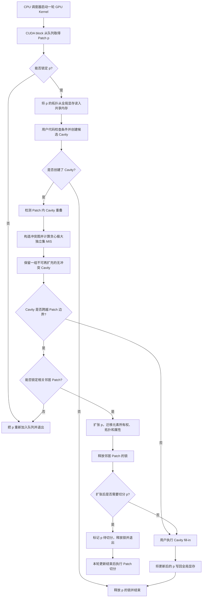

# 《Dynamic Mesh Processing on the GPU》算法逻辑流程中文总结

## 1. 论文信息

- 题目：Dynamic Mesh Processing on the GPU
- 作者：Ahmed H. Mahmoud、Serban D. Porumbescu、John D. Owens
- 期刊：ACM Transactions on Graphics，Vol. 44，No. 4，2025
- DOI：10.1145/3731162
- 原始 PDF：`D:\laien\文档\remesh\qt1sm051d2.pdf`

## 2. 一句话概括

这篇论文提出的不是 SDF 网格优化算法，而是一套完全运行在 GPU 上的通用动态三角网格处理框架：它把边折叠、边分裂、边翻转、面分裂等局部拓扑修改统一描述为 **Cavity（空腔）操作**，再利用 **Patch 分块、共享内存、极大独立集和推测执行**，并行完成大量可能互相冲突的局部修改。

其核心思想可以概括为：

> 先删除局部网格元素形成空腔，筛选出互不重叠的空腔，再并行填补空腔；具体修改规则由用户提供，冲突检测、调度、锁、回滚和数据结构维护由系统负责。

## 3. 系统要解决的问题

动态网格算法会改变顶点、边和面的连接关系。与静态网格计算相比，它有四个主要难点：

1. **局部性**：一次修改通常只影响很小的邻域，但传统全局数据结构会造成大量不规则显存访问。
2. **冲突处理**：两个局部修改若接触同一网格元素，同时执行可能破坏拓扑。
3. **存储紧凑性**：GPU 显存和共享内存有限，数据结构不能像 CPU Halfedge 那样保存过多冗余邻接信息。
4. **调度**：既要保证网格始终有效，又要让尽可能多的修改并行执行。

论文的解决方案是把“用户想做什么”和“GPU 上如何安全并行执行”分离。

## 4. 核心抽象：Cavity 空腔操作

### 4.1 定义

一个 Cavity 是一组连通的顶点、边和面。删除这些元素后，网格中形成一个局部空洞。任何局部动态操作都被拆成两个阶段：

1. **Cavity creation（创建空腔）**：选择种子元素，并删除种子及规定的邻接/关联元素。
2. **Cavity fill-in（填补空腔）**：在空腔边界内加入新的顶点、边和面。

例如：

- 边折叠：删除目标边及其局部关联结构，再用一个新顶点和相应的边、面填补。
- 边分裂：删除原边及关联面，加入新顶点和细分后的边、面。
- 边翻转：删除一条边及其两个关联三角形，连接两个对角顶点并生成两个新三角形。
- 面分裂：删除原三角形，在内部增加顶点并生成多个新三角形。

### 4.2 冲突判定

论文给出了非常直接的冲突语义：

- 两个 Cavity 不重叠：可以并行执行。
- 两个 Cavity 包含相同网格元素：发生冲突，只允许其中一个执行。

这样用户不需要知道底层存储方式，也不需要自行决定应该锁一环还是二环邻域。

## 5. GPU 数据结构

### 5.1 Patch 分块

输入三角网格首先被划分成许多小 Patch。每个 Patch 对应一个 CUDA block，并且其拓扑数据能够放入 GPU 共享内存。

- 动态应用的实验中，初始 Patch 大小设为约 256 个面。
- 静态应用中使用约 512 个面。
- Patch 允许增长到初始大小的 2 倍，超过后进行切分。
- 初始分块使用修改后的 Lloyd `k`-means 聚类方法。

一个 CUDA block 处理一个 Patch 时：

1. 从全局显存一次性读入 Patch；
2. 在共享内存中完成查询、空腔创建、冲突处理和拓扑更新；
3. 最后把结果整体写回全局显存。

因此，大多数不规则访问发生在低延迟、高带宽的共享内存中。

### 5.2 拓扑表示

系统只保存自顶向下的连接关系：

- `FE`：Face 到 Edge；
- `EV`：Edge 到 Vertex。

它不保存每个顶点的完整邻接关系，因此数据结构更紧凑，也使“不重叠的 Cavity 可以安全并行”这一规则成立。

由于单个 Patch 很小，局部索引可以使用 16 位整数。系统还为顶点、边和面维护 active bitmask：

- 删除元素：把 active 位清零；
- 添加边或面：追加相应的 `EV` 或 `FE`；
- 添加顶点：增加顶点计数。

### 5.3 Ribbon 边界副本

Patch 边界外的一圈邻接元素称为 Ribbon。它让 Patch 能够查询跨分块的邻域。

由于动态操作会改变元素归属，Ribbon 不能像静态 RXMesh 那样固定存储。论文使用 GPU Cuckoo Hash Table 保存：

- 本 Patch 中的局部元素索引；
- 元素所属的 owner Patch；
- 元素在 owner Patch 内的局部索引。

同时用 bitmask 快速区分 owned 元素和 Ribbon 元素。

### 5.4 属性存储

顶点、边、面的几何属性按 Patch 分配在全局显存中，而不是存成一个全局大数组。这样可以：

- 避免频繁维护“局部索引到全局索引”的映射；
- Patch 扩张或切分时更容易迁移属性；
- 提高缓存和显存访问的局部性。

## 6. 完整运行流程

下面是论文图 7 所描述的主流程。



### 6.1 取得并锁定 Patch

系统使用 GPU 上的并行数组队列。每个 CUDA block 选出一个 leader thread：

1. leader 从队列取出 Patch；
2. 尝试获取该 Patch 的锁；
3. 失败则重新入队，当前 block 退出；
4. 成功则向 block 内其他线程广播 Patch 编号。

处理完成的 block 可以继续从队列领取新 Patch，从而改善负载均衡。

### 6.2 在共享内存中创建候选 Cavity

用户先计算操作判定条件，例如：

- 边是否过长，需要分裂；
- 边是否过短，需要折叠；
- 两个对角之和是否大于 180°，需要 Delaunay 翻转；
- 顶点价数是否需要调整。

满足条件时，用户调用预定义或自定义的 Cavity 模板。系统原子递增 Patch 内的 Cavity 数量，并为种子记录 Cavity ID。

### 6.3 处理 Patch 内冲突

系统把每个种子的 Cavity ID 向模板规定的邻接元素传播：

- 从低维元素传播到高维元素时使用 gather；
- 从高维元素传播到低维元素时使用原子操作。

若两个 Cavity 的 ID 写到同一个元素，就说明二者重叠。系统据此构造冲突图：

- 图节点表示候选 Cavity；
- 图边表示两个 Cavity 冲突。

然后并行计算贪心极大独立集 MIS，选出一组互不冲突且无法再加入其他候选的 Cavity。它不保证得到全局基数最大的独立集，但能高效产生具有较高并行度的可执行集合。未选中的操作留到后续迭代重新尝试。

### 6.4 处理跨 Patch 冲突

如果 Cavity 接触相邻 Patch，系统不会同时修改两个 Patch，而是临时扩张当前 Patch `p`，使整个 Cavity 完全落入 `p`：

1. 尝试锁定受影响的邻居 Patch；
2. 获取失败：丢弃当前共享内存中的修改，把 `p` 重新入队；
3. 获取成功：读取邻居的必要拓扑；
4. 将相关元素的所有权、连接关系和属性迁移到 `p`；
5. 从邻居 Patch 中停用这些元素；
6. 释放邻居 Patch 的锁；
7. 在 `p` 内继续填补 Cavity。

这是一种“以更多读取换取更少写入”的设计。邻居只需要停用少量元素，不必在两个 Patch 中重复执行 fill-in。

### 6.5 Cavity fill-in

对于 MIS 中保留下来的每个 Cavity，系统提供：

- 空腔边界边和边界顶点的迭代器；
- 被删除的旧拓扑；
- 被删除元素的旧属性。

用户使用这些信息添加新顶点、边、面以及对应属性。用户也可以根据自定义条件回滚某个 Cavity。

完成后，整个 Patch 被写回全局显存并释放锁。

### 6.6 Patch 过大时切分

Patch 扩张后若超过预分配容量，系统先标记待切分，并在本轮更新结束后处理：

1. 对 Patch 运行 10 次 Lloyd `k`-means；
2. 新建 Patch `q`，原 Patch `p` 保留；
3. 将属于 `q` 的拓扑和属性从 `p` 复制过去；
4. 在 `p` 中停用相应元素；
5. 重建二者接口处的 Ribbon。

## 7. 推测执行与回滚

论文比较了串行化、两阶段处理、图着色和推测执行，最终采用推测执行。

其关键依据是：

- 当前工作副本位于共享内存；
- 全局显存中的 Patch 在提交前保持不变；
- 如果邻居锁获取失败，只需丢弃共享内存副本；
- 因此回滚几乎没有额外的数据恢复成本。

同步主要发生在最终提交前，以及需要扩张 Patch 时。论文实验显示，大网格中被丢弃的推测任务比例会显著下降，最坏测试中可低于约 2%。

## 8. 锁算法

CUDA 没有直接提供适合该场景的内核内 Patch 锁，因此论文实现了带退避的 spinlock：

1. block 内只选一个线程申请锁，减少原子操作竞争；
2. 使用 `atomicCAS` 尝试把锁从 FREE 改为 LOCKED；
3. 多次失败后，在每个 Patch 的 `spinner` 上执行 `atomicMin(threadID)`；
4. ID 最小的竞争者继续尝试，其余竞争者失败返回；
5. 失败的 Patch 被重新调度，而不是一直占用 SM 等待；
6. 释放锁时同时重置 `spinner`。

这保证了竞争时至少有一个申请者能够继续前进，同时降低死锁风险。

## 9. 论文中的各应用算法

### 9.1 均匀各向同性重网格

论文中的 isotropic remeshing 每轮包含四个完整的网格遍历阶段：

```text
输入三角网格
    ↓
计算目标边长 targetLen
论文实验中 targetLen = 输入网格的平均边长
    ↓
分裂长边
    ↓
折叠短边
    ↓
通过边翻转调整顶点价数
    ↓
顶点平滑
    ↓
是否达到迭代次数？
    ├─ 否：返回“分裂长边”
    └─ 是：输出重网格结果
```

论文实验运行 3 轮。每个阶段中的局部操作都被转换成 Cavity，利用相同的 MIS、Patch 扩张、fill-in 和提交流程并行执行。

需要注意：

- 论文明确说明 `targetLen` 取输入网格的平均边长；
- 论文没有给出“长边”和“短边”相对 `targetLen` 的具体阈值；
- 论文没有在此算法中使用 `creaseAngle`；
- 论文没有使用 `maxSurfDist`；
- 此处也没有 SDF 生成或 SDF 零面投影步骤。

因此，若将论文方法用于当前项目，`targetLen` 对 isotropic remeshing 有直接作用，而 `creaseAngle` 和 `maxSurfDist` 属于需要额外增加的特征保护/曲面偏差约束。

### 9.2 曲面跟踪

每个时间步的逻辑为：

```text
根据速度场推进曲面
    ↓
执行网格质量改进
    ├─ 边分裂
    ├─ 边折叠
    ├─ 边翻转
    └─ 零空间顶点平滑
    ↓
进入下一时间步
```

论文实现与关闭碰撞检测、关闭拓扑变化后的 El Topo 行为对应。其重点是证明框架可以在长时间、多轮动态修改中持续工作。

### 9.3 Delaunay 边翻转

```text
遍历边 e
    ↓
计算 e 两侧三角形的两个对角
    ↓
对角和是否 > 180°？
    ├─ 否：跳过
    └─ 是：把 e 及其两个关联面注册为 Cavity
              ↓
          MIS 选择无冲突 Cavity
              ↓
          连接原来的两个对角顶点
              ↓
          创建两个新三角形
              ↓
是否还有非 Delaunay 边？
    ├─ 是：继续迭代
    └─ 否：结束
```

该过程保持网格规模基本不变，但会大量改变连接关系，因此适合测试 Patch 扩张和冲突调度。

### 9.4 最短边批量折叠

严格地每次只折叠一条最短边不适合 GPU。论文采用近似的分批优先策略：

1. 统计边长直方图；
2. 对直方图做包含式前缀和；
3. 找出属于最短 `top-k` 范围的边；
4. 将这些边的折叠操作注册为 Cavity；
5. 并行折叠 MIS 选出的无冲突边；
6. 重新计算直方图；
7. 重复，直到达到目标顶点数。

实验使用 256 个直方图区间，每轮尝试最短的 1% 边。它牺牲严格的全局排序，换取更高的并行度。

### 9.5 测地距离

测地距离应用不改变网格拓扑，主要用于验证动态数据结构不会降低静态查询性能：

1. 从源顶点计算拓扑层级，即顶点到源点的 hop 数；
2. 按层分批激活顶点；
3. GPU 上并行更新测地距离和误差；
4. 已收敛顶点退出，激活下一层；
5. 逐层传播直到所有顶点完成。

## 10. 高层伪代码

```text
preprocess(mesh):
    patches = partition_mesh(mesh)
    build_FE_EV(patches)
    build_ribbons_and_hash_tables(patches)
    allocate_patch_capacity()
    enqueue_all_patches()

while scheduler_queue is not empty:
    launch_GPU_kernel()

GPU_block():
    p = dequeue_patch()
    if p is invalid:
        return

    if not lock(p):
        enqueue(p)
        return

    local_p = copy_global_to_shared(p)
    cavities = user_create_cavities(local_p)

    if cavities is empty:
        unlock(p)
        return

    conflict_graph = find_overlapping_cavities(cavities)
    active_cavities = greedy_MIS(conflict_graph)

    neighbours = find_imprinted_neighbour_patches(active_cavities)
    if neighbours is not empty:
        if not lock(neighbours):
            discard(local_p)
            unlock(p)
            enqueue(p)
            return

        expand_patch(local_p, neighbours)
        unlock(neighbours)

        if local_p exceeds capacity:
            mark_for_slicing(p)
            discard(local_p)
            unlock(p)
            return

    user_fill_cavities(local_p, active_cavities)
    copy_shared_to_global(local_p, p)
    unlock(p)

slice_marked_patches()
```

## 11. 性能结果的正确理解

论文报告的代表性结果包括：

- 均匀各向同性重网格相对 WMTK 的几何平均加速约 30 倍；
- 相对单线程 PMP 的几何平均加速约 4.6 倍；
- 大网格 Delaunay 边翻转相对 WMTK 可达到约 12-37 倍加速；
- 静态测地距离相对 RXMesh 的几何平均加速约 1.2 倍；
- 静态数据结构约需 18.75 bytes/face，约为 RXMesh 的一半。

这些计时只包含应用运行时间，不包含初始分块和数据结构初始化。

## 12. 局限性

1. **只适合局部拓扑修改**：不适合一次改变整个网格的操作，例如全局细分。
2. **Cavity 宽度受限**：Ribbon 只有一个三角形宽，因此 Cavity 必须能够落入该范围。
3. **小网格并行度不足**：Patch 和候选操作太少时，GPU 可能不如 CPU。
4. **局部热点并行度不足**：若所有修改集中在很小区域，大量操作会冲突。
5. **跨 Patch 访问昂贵**：论文实验中，Delaunay 应用处理邻居 Patch 的成本约占总运行时间的四分之三。
6. **需要预分配内存**：分配过多会浪费显存，分配不足会导致应用失败。
7. **并行调度可能改变结果细节**：例如重网格最终面数或局部连接关系可能与串行实现略有差异。
8. **不负责几何保真约束**：论文框架负责动态拓扑并行化，但 `creaseAngle`、到原曲面的最大距离和 SDF 投影需要由具体应用自行实现。

## 13. 与当前 SDF 优化工作的关系

这篇论文可以帮助加速带拓扑变化的网格优化阶段，但不能直接替代 SDF 约束：

- 如果优化只移动顶点且连接关系固定，Cavity 框架的价值有限；
- 如果需要根据 `targetLen` 分裂长边、折叠短边或翻转边，Cavity 框架很合适；
- `creaseAngle` 可以加入用户的操作判定条件，用于禁止特征边折叠/翻转；
- `maxSurfDist` 可以在 fill-in 前后作为用户定义的几何合法性条件；
- SDF 值或到原始曲面的距离可以作为 Cavity rollback 条件；
- 论文框架负责“如何安全并行更新拓扑”，SDF 负责“新顶点应该位于什么几何位置”。

两者结合时，一个合理流程是：

```text
SDF 重建初始闭合网格
    ↓
依据 targetLen 创建 split/collapse 候选
    ↓
依据 creaseAngle 过滤特征边
    ↓
Cavity + MIS 并行修改拓扑
    ↓
新顶点投影到 SDF 零面
    ↓
检查 maxSurfDist、翻面、退化和自交
    ↓
不合法则 rollback，合法则提交 Patch
```

## 14. 最终结论

论文最重要的贡献不是重新定义某一种 remeshing 数学目标，而是给出一套通用的 GPU 执行机制：

1. 用 Cavity 统一所有局部动态网格操作；
2. 用 Patch 把拓扑访问局部化到共享内存；
3. 用重叠 Cavity 定义冲突；
4. 用贪心极大独立集选出一组可并行且不可继续扩充的操作；
5. 用 Patch 扩张把跨分块操作转化为单 Patch 修改；
6. 用推测执行和低成本回滚减少等待；
7. 用队列调度、Patch 锁和延迟切分维持执行进度。

对于需要边分裂、边折叠、边翻转的 SDF remeshing 项目，这篇论文最值得借鉴的是 **并行拓扑修改框架**；SDF 采样、零面投影、特征保护和曲面误差控制仍需要在用户算法层补充。
