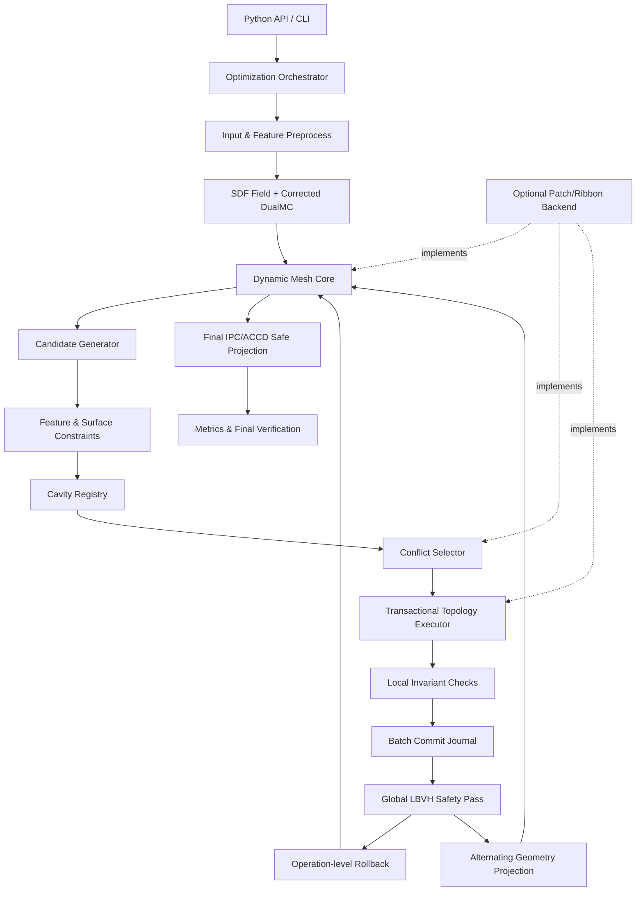
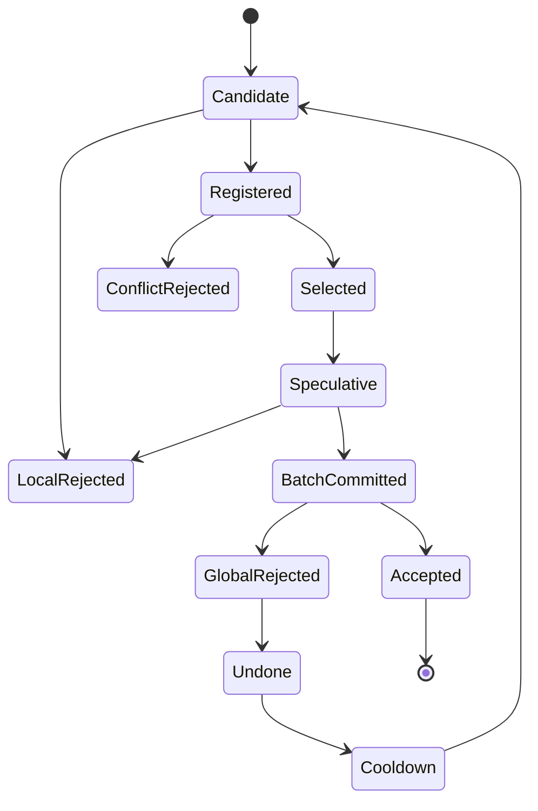

# PaMO + Cavity/Patch 联合改善架构

状态：提案  
适用仓库：`D:\opensource\pamo`  
关联分析：

- [Dynamic Mesh Processing on the GPU 算法总结](./Dynamic_Mesh_Processing_on_the_GPU_算法流程中文总结.md)
- [PaMO 论文算法中文分析](./PaMO_论文算法中文分析.md)

## 1. 决策摘要

目标不是把第一篇论文的全部实现机械搬入 PaMO，而是将两篇论文按职责组合：

- PaMO 保留 SDF/DualMC、边成本、LBVH 相交检测、Undo 和 IPC/ACCD 安全投影；
- Cavity/Patch 提供统一动态拓扑操作、冲突语义、事务记录和可扩展的 GPU 调度后端；
- 原始网格特征图、`targetLen` 场和 `maxSurfDist` 成为所有拓扑操作的硬约束；
- 拓扑修改与几何投影由完全串行的三阶段流程，演进为可交替执行的联合优化流程。

采用两步迁移：

1. **Cavity-lite**：先在 PaMO 当前全局数组数据结构上加入统一操作描述、事务日志、特征约束、局部验收、split/flip 和交替投影。
2. **Patch backend**：质量收益经过验证后，再实现 Patch、Ribbon、共享内存、队列调度、MIS、Patch 扩张和切分。

这一路线优先验证几何质量和特征保持收益，避免在收益未知时进行完整底层重写。

## 2. 目标与非目标

### 2.1 目标

1. 对任意输入继续提供 repair 模式，对合法封闭输入优先使用精确 `SDF=0`。
2. 在同一动态操作框架中支持：
   - edge collapse；
   - edge split；
   - edge flip；
   - constrained vertex relocation。
3. 显式保留原始特征边 lineage 和角点。
4. 对受约束区域提供可配置的 `maxSurfDist` 硬验收。
5. 每个已提交检查点满足：
   - 索引有效；
   - 面非退化；
   - 定向不翻转；
   - 要求流形时满足 Link Condition；
   - 没有自交；
   - 硬特征约束未被破坏。
6. 支持拓扑操作与安全投影交替执行。
7. 保留当前 PaMO 默认路径作为可比较、可回退的基线。
8. 所有新增能力具有确定性测试、消融测试和性能遥测。

### 2.2 非目标

1. 第一阶段不把体素生成和 DualMC 改写成 Cavity 操作。
2. 第一版不追求完全复现第一篇论文的每项内存布局。
3. 不承诺任意输入一定能够达到用户要求的极端目标面数。
4. 不使用 Chamfer Distance 代替最大局部偏差约束。
5. 不把最终全局 IPC/ACCD 求解器强行局部化到单个 Patch。
6. 不删除现有 `remesh_only`、`feature_remesh`、`sdf_optimize` 和 `original_constrained_remesh` 模式。

## 3. 当前架构基线

### 3.1 当前主流程

当前 `PaMO.run()` 的默认路径是：

```text
输入网格
→ SDF/UDF + DualMC
→ CUDA 并行边折叠
→ LBVH 自交检测与 Undo
→ Warp 安全投影
```

主要模块：

| 模块 | 当前文件 | 可复用性 |
|---|---|---|
| SDF/DualMC 调度 | `simp_cuda/pamo/__init__.py` | 直接保留 |
| SDF 语义 | `simp_cuda/pamo/sdf_field.py` | 直接保留并扩展 provenance |
| 边折叠与成本传播 | `simp_cuda/src/cusimp*.cu` | 抽取为 candidate/collapse operator |
| 简化数据 | `simp_cuda/src/cusimp_free.h` | 迁移期兼容，最终由 MeshCore 替代 |
| LBVH 与相交检测 | `simp_cuda/src/bvh/` | 直接复用，增加 operation ID 回溯 |
| Feature edge 工具 | `simp_cuda/pamo/feature_edges.py` | 作为 FeatureGraph 原型 |
| 原始约束细分 | `simp_cuda/pamo/original_constrained.py` | 复用 lineage 与投影思想 |
| Safe Projection | `simp_cuda/safe_project/` | 保留为全局几何优化器 |
| Python/CUDA 绑定 | `simp_cuda/src/pybind.cpp` | 扩展新接口，旧接口保留 |

### 3.2 当前关键缺口

1. CUDA 简化器只有固定的 edge-collapse 路径，没有通用操作接口。
2. 折叠成本不直接查询原始网格，不包含硬 `maxSurfDist`。
3. Stage 2 和 Stage 3 完全解耦。
4. 特征边功能分散在 Python 后处理和原始约束模式中，没有统一 GPU FeatureGraph。
5. Undo 以折叠边为中心，无法统一表示 split/flip/relocate。
6. 当前全局数组在每轮重新构造边和邻接，缺少稳定元素 ID 和事务版本。
7. 安全投影默认配置中 `GT2Mesh` 距离项未启用，需要与论文目标重新核对和消融。
8. 缺少覆盖整个主流程的自动化测试目录。
9. `simp_cuda/setup.py` 当前只收集 `src/*.cu`，新增的 `src/dynamic/` 和 `src/patch/` 子目录需要递归构建支持。

## 4. 目标分层架构



### 4.1 编排层

`OptimizationOrchestrator` 负责：

- 选择 `exact` 或 `repair` SDF 语义；
- 初始化 FeatureGraph；
- 选择 `global` 或 `patch` 动态后端；
- 调度 topology epoch 和 projection epoch；
- 控制停止条件；
- 记录每轮质量、失败原因和耗时；
- 最后执行全局安全投影和验收。

它不直接实现 CUDA 拓扑操作。

### 4.2 动态网格核心

`DynamicMeshCore` 提供统一的网格状态：

```text
vertices              float32[N,3]
faces                 int32[M,3]
edges                 int32[E,2]
vertex_active         bitset[N]
edge_active           bitset[E]
face_active           bitset[M]
element_generation    uint32[]
face_last_operation   uint32[M]
vertex_feature_class  uint8[N]
edge_feature_id       int32[E]
```

迁移期允许底层仍使用当前全局数组；Patch 后端再替换其物理存储。

元素句柄使用：

```text
ElementHandle = {local_or_global_id, generation}
```

`generation` 防止数组槽位复用后，旧事务错误引用新元素。

### 4.3 FeatureGraph

FeatureGraph 从原始网格提取，而不是从已经模糊的 SDF 输出重新推断。

核心数据：

```text
feature_vertices
feature_edges
feature_chains
corner_vertices
boundary_chains
nonmanifold_chains
feature_parent_id
feature_param_t
```

顶点分类：

| 类型 | 允许移动 |
|---|---|
| Regular | 曲面切向移动后投影 |
| Feature | 只能沿对应特征曲线移动 |
| Corner | 默认固定 |
| Boundary | 沿边界曲线移动 |
| Nonmanifold constraint | 默认固定或只允许显式规则 |

FeatureGraph 必须记录 split/collapse 后的 lineage：

- 分裂特征边：两个子边继承同一 feature ID；
- 折叠特征边：仅允许同链、同方向且不吞并角点；
- 翻转特征边：禁止；
- 普通操作不得跨越 feature partition。

### 4.4 TargetLengthField

目标边长不再只有一个常量，而是一个空间场：

```text
target_len(x) =
    clamp(base_len / (1 + curvature_weight * curvature(x)),
          min_len,
          max_len)
```

可叠加：

- 特征链专用目标边长；
- 边界专用目标边长；
- 局部用户权重；
- SDF 体素下限；
- 原始网格采样密度。

操作判定建议：

```text
split  if length > split_ratio * target_len
collapse if length < collapse_ratio * target_len
```

两个阈值应留出滞回区间，避免同一条边在相邻 epoch 中反复 split/collapse。

### 4.5 SurfaceConstraint

统一原始曲面和 SDF 查询：

```text
nearest_original(point)
distance_original(point)
sdf_value(point)
sdf_gradient(point)
project_original(point)
project_feature(point, feature_id)
project_sdf_zero(point)
```

每个查询返回：

```text
position
distance
primitive_id
normal
validity
field_semantics
```

`field_semantics` 明确区分：

- `exact_zero_surface`；
- `repair_envelope`；
- `original_triangle_surface`；
- `feature_curve`。

避免把投影到 repair 零面误写成投影到原始曲面。

## 5. Cavity-lite 操作模型

### 5.1 OperationRecord

第一阶段不立即实现完整 Patch Cavity，而是引入统一操作记录：

```text
OperationRecord:
    id
    type
    seed_handle
    read_set
    remove_set
    boundary_set
    insert_counts
    affected_aabb
    target_position
    target_feature_id
    cost
    status
    reject_reason
    snapshot_offset
```

支持操作：

- `EDGE_COLLAPSE`
- `EDGE_SPLIT`
- `EDGE_FLIP`
- `VERTEX_RELOCATE`

### 5.2 生命周期



状态解释：

- `LocalRejected`：特征、拓扑、距离、翻面或退化检查失败；
- `ConflictRejected`：与更高优先级操作读写集合冲突；
- `GlobalRejected`：批量提交后被 LBVH 判定造成自交；
- `Cooldown`：若干 epoch 内禁止再次选择同一 lineage。

### 5.3 冲突语义

两个操作冲突，当且仅当：

```text
write(A) intersects read_or_write(B)
or
write(B) intersects read_or_write(A)
```

Cavity-lite 可先使用当前 PaMO 的局部最小成本传播选择 collapse；新增 split/flip 采用 element owner 的原子竞争。

后续统一为显式冲突边和贪心极大独立集。

## 6. 拓扑操作定义

### 6.1 Edge Collapse

候选生成：

1. 满足 Link Condition；
2. 边长低于局部 collapse 阈值，或 PaMO 总成本低于阈值；
3. 不跨 feature partition；
4. 不删除受保护角点；
5. 计算多个目标位置：
   - 中点；
   - QEM 最优点；
   - 原始曲面投影点；
   - SDF 零面投影点；
   - 特征曲线投影点。

目标位置评分：

```text
collapse_score =
    qem
  + length_weight * edge_length
  + skinny_weight * post_triangle_penalty
  + surface_weight * original_distance
  + feature_weight * feature_deviation
```

硬拒绝条件优先于成本：

- `distance_original > maxSurfDist`；
- 新面面积低于阈值；
- 局部定向翻转；
- feature lineage 非法；
- 局部碰撞。

### 6.2 Edge Split

使用场景：

- 边长超过局部 split 阈值；
- 特征曲线采样不足；
- 高曲率区域几何误差超限。

规则：

- 普通边新点投影到原曲面或精确 SDF；
- 特征边新点投影到对应特征曲线；
- 子边继承 feature ID 和参数区间；
- 新三角形必须通过面积、定向和局部碰撞检查。

### 6.3 Edge Flip

候选目标：

- 改善顶点价数；
- 提高最小角；
- 降低局部能量；
- 改善 target length 分布。

禁止：

- 特征边；
- 边界边；
- 非流形边；
- 翻转后造成定向异常、退化、距离超限或碰撞。

### 6.4 Vertex Relocate

作为轻量 topology epoch 后的局部几何步骤：

- Regular：切向 Laplacian/QEM 移动，再投影；
- Feature：沿特征切线移动，再投影到 feature curve；
- Corner：固定；
- 所有移动经过局部 CCD 或保守步长限制。

它不能替代最终全局 IPC/ACCD。

## 7. `maxSurfDist` 硬约束

### 7.1 单位

内部统一使用归一化尺度：

```text
normalized_max_dist = world_max_dist / bbox_max_extent
```

API 同时接受：

- `world`；
- `relative_bbox`；
- `voxel`。

配置中必须显式记录单位，禁止裸浮点值在不同尺度模型之间复用。

### 7.2 检查采样

只检查新顶点不足以控制新三角形内部偏差。每个操作至少检查：

- 新顶点；
- 新边中点；
- 新三角形重心；
- 高曲率或大三角形上的额外重心坐标采样；
- 原始特征链到输出特征链的反向采样。

### 7.3 双向验收

局部操作检查输出到原始曲面的偏差：

```text
max_{x in changed_output} distance(x, original) <= maxSurfDist
```

周期性全局验收还要检查原始表面到输出的覆盖，防止输出漏掉局部结构。

`maxSurfDist` 是采样意义下的上界；若需要严格 Hausdorff 保证，需要三角形包络或区间方法，列为后续增强项。

## 8. 安全系统与事务

### 8.1 三层安全检查

| 层级 | 时机 | 检查 |
|---|---|---|
| L0 Candidate | 注册前 | 快速特征、Link、长度和容量检查 |
| L1 Local | 共享/临时拓扑上 | 面积、定向、局部距离、局部碰撞 |
| L2 Global | 批量提交后 | LBVH 全局自交与全局质量采样 |

L0/L1 用于减少昂贵全局 Undo，L2 提供最终安全网。

### 8.2 CommitJournal

每轮批量提交生成：

```text
CommitJournal:
    epoch_id
    operation_ids
    modified_vertex_ranges
    modified_face_ranges
    deleted_elements
    inserted_elements
    old_values
    new_values
    affected_aabbs
```

`face_last_operation` 将相交三角形映射回 operation ID。

### 8.3 Undo 策略

1. 对每个相交对收集两个三角形的 `last_operation`；
2. 建立需要撤销的 operation 集合；
3. 如果因果关系不明确，保守撤销两个相关操作；
4. 按逆提交顺序恢复；
5. 重建受影响邻接和 BVH；
6. 重复全局相交检测，直到无自交；
7. 将失败 lineage 加入 cooldown。

Undo 不再只保存两个折叠顶点，而是保存通用事务快照。

### 8.4 失败原因编码

```text
FEATURE_CROSSING
CORNER_REMOVAL
LINK_CONDITION
NON_MANIFOLD
DEGENERATE_FACE
ORIENTATION_FLIP
SURFACE_DISTANCE
LOCAL_COLLISION
GLOBAL_COLLISION
PATCH_CAPACITY
LOCK_CONFLICT
NUMERICAL_FAILURE
```

所有拒绝都必须可统计。

## 9. 拓扑与几何交替优化

### 9.1 Epoch 设计

```text
Topology epoch:
    generate candidates
    select conflicts
    execute operations
    local checks
    batch commit
    global collision/undo

Projection epoch:
    constrained local relocation
    optional short safe-projection step
    refresh target positions
    refit/rebuild BVH
```

推荐初始策略：

- 每个 topology epoch 后执行局部受约束投影；
- 每 `K` 个 topology epoch 执行一次短安全投影；
- 达到目标后执行完整安全投影；
- 若全局碰撞率或距离拒绝率升高，提前触发 projection epoch。

### 9.2 为什么不每轮执行完整 Safe Projection

当前安全投影每个 step 内含多轮 Newton、CG、接触检测和线搜索。每个拓扑 epoch 后完整执行会：

- 大幅增加运行时间；
- 频繁重建拓扑相关数据；
- 破坏 CUDA Graph 复用；
- 使性能收益难以验证。

因此使用“局部快速投影 + 周期性短求解 + 最终完整求解”。

### 9.3 Safe Projection 对齐论文目标

当前默认配置启用了：

- Mesh-to-GT；
- Elastic；
- Hinge；
- Collision。

而 GT-to-Mesh 距离计算器默认被注释。改善架构要求：

1. 建立论文模式配置，显式启用双向距离；
2. 建立兼容模式配置，保持当前默认；
3. 对时间、CD、HD、特征召回率和最小角进行消融；
4. 根据显存和收益决定最终默认值。

## 10. 完整 Patch/Ribbon 后端

Patch 后端属于第二阶段迁移。

### 10.1 Patch 数据

```text
Patch:
    owned vertices/edges/faces
    active bitsets
    FE connectivity
    EV connectivity
    ribbon hash
    neighbor stash
    version
    lock
    capacity
```

建议默认：

- 动态 Patch 初始约 256 faces；
- 最大容量约初始的 2 倍；
- 16 位局部索引；
- 属性按 Patch 分配；
- Ribbon 先保持一圈。

### 10.2 调度

GPU 队列为每个 CUDA block 分配 Patch：

1. block leader 出队；
2. 获取 Patch 锁；
3. 拷贝 Patch 到共享内存；
4. 创建候选 Cavity；
5. 计算 Patch 内贪心极大独立集；
6. 必要时锁邻居并扩张 Patch；
7. 共享内存执行和局部验收；
8. 写回全局内存；
9. 释放锁；
10. 失败 Patch 重新入队。

### 10.3 Patch 与全局 LBVH 的边界

Patch 提交后不能立刻宣称全局无自交。需要设置 batch barrier：

```text
多个 Patch 并行提交
→ 完成一个 commit batch
→ 更新/refit 全局 LBVH
→ 全局相交检测
→ 按 operation ID Undo
→ 开始下一批
```

第一版 Patch 后端不允许在全局验收完成前覆盖事务快照。

### 10.4 Patch 切分

当 Patch 容量不足：

- 标记待切分；
- 当前拓扑操作不提交；
- 在批次末进行局部重分区；
- 更新 owner、Ribbon、邻接和属性；
- 递增 Patch version；
- 将新 Patch 入队。

## 11. API 设计

### 11.1 Python 配置

```python
config = DynamicOptimizeConfig(
    backend="global",                 # global | patch
    sdf_mode="auto",                  # auto | exact | repair
    operations=("split", "collapse", "flip", "relocate"),
    target_length_mode="curvature",   # constant | curvature | field
    target_length=1.0,
    feature_angle=30.0,
    max_surface_distance=0.001,
    max_surface_distance_unit="relative_bbox",
    preserve_boundaries=True,
    preserve_nonmanifold_features=True,
    projection_every=5,
    global_collision_every=1,
    final_safe_projection_steps=5,
    deterministic=True,
)
```

### 11.2 新入口

```python
verts, faces, report = pamo.dynamic_optimize(
    points,
    triangles,
    target_faces=...,
    config=config,
)
```

返回的 `report` 至少包含：

```text
accepted operations by type
rejected operations by reason
undo count
collision pairs
CD / HD samples
feature recall
edge length CV
minimum angle
runtime by stage
peak GPU memory
termination reason
```

旧 `run()` 行为不变。

## 12. 不变量

### 12.1 每个局部提交必须满足

1. 所有活动 face 引用活动 vertex；
2. face 三个顶点互异；
3. 面积大于尺度相关阈值；
4. 受影响面相对旧面不发生非法翻转；
5. Link Condition 要求满足；
6. 硬特征 lineage 有效；
7. 局部偏差不超过配置阈值；
8. 新元素句柄 generation 正确。

### 12.2 每个全局批次必须满足

1. 没有自交；
2. 目标模式要求的流形/封闭性质成立；
3. FeatureGraph 与输出约束映射一致；
4. 全局 directed-distance 采样未超限；
5. BVH 与活动面集合一致；
6. Undo journal 可以丢弃前，所有检查均通过。

### 12.3 最终输出必须满足

1. 面数达到目标，或返回明确不可达原因；
2. 无 NaN/Inf；
3. 无退化面；
4. 无重复面；
5. 无自交；
6. 报告流形和封闭状态；
7. 报告 CD、HD 采样值与 feature recall；
8. 所有硬约束失败都可追溯。

## 13. 测试架构

### 13.1 单元测试

- ElementHandle generation；
- FeatureGraph 分类和 lineage；
- 每类 Cavity 的 read/write/remove/boundary set；
- collapse Link Condition；
- split/flip 定向；
- `maxSurfDist` 单位转换；
- operation 状态机；
- CommitJournal round-trip；
- Undo 后字节级或拓扑等价恢复。

### 13.2 几何用例

最小合成网格：

- 单三角形；
- 两三角形方片；
- 四面体；
- 立方体；
- 带尖脊楔体；
- 带孔薄板；
- 双层薄壳；
- 共面重叠三角形；
- 单顶点共享自交；
- 单边共享正常/异常情况；
- 需要跨 Patch 的折叠、分裂和翻转。

### 13.3 回归集

建立小型、可提交的固定网格集，覆盖：

- 合法封闭；
- 开放；
- 非流形；
- 自交；
- 高曲率；
- CAD 尖角；
- 细孔和窄缝；
- 极瘦三角形。

每个模型保存：

- 期望模式；
- 目标面数；
- 允许 CD/HD 上界；
- 硬 feature recall；
- 是否必须封闭；
- 最大运行时间基线。

### 13.4 性能基准

至少三档：

- small：`<10k` faces；
- medium：`100k-500k` faces；
- large：`1M-5M` faces。

比较：

- 当前 PaMO；
- Cavity-lite；
- Patch backend；
- feature/max-distance 开关消融；
- 双向距离开关消融。

## 14. 指标

### 14.1 几何质量

- Chamfer Distance；
- sampled Hausdorff Distance；
- directed max distance；
- 最小角；
- 坏三角形比例；
- edge length CV；
- 法向误差；
- 平面拟合误差。

### 14.2 特征质量

- feature edge recall；
- feature edge precision；
- corner retention；
- feature curve Hausdorff；
- 二面角误差；
- 被错误折叠/翻转的硬特征数，目标必须为 0。

### 14.3 安全与拓扑

- 自交对数；
- manifold；
- watertight；
- 退化面数；
- Undo 次数；
- global collision false-positive investigation count；
- termination reason。

### 14.4 性能

- 候选生成时间；
- 冲突选择时间；
- 拓扑执行时间；
- 局部验收时间；
- LBVH build/refit/query；
- Undo；
- projection；
- 总时间；
- 峰值显存；
- Patch rollback/lock failure/slice 比例。

## 15. 迁移阶段

### Phase 0：基线和可观测性

- 固定当前输出；
- 建立回归数据；
- 补齐质量与性能指标；
- 记录当前默认行为。

### Phase 1：Cavity-lite 与事务

- OperationRecord；
- 统一状态机；
- CommitJournal；
- 通用 Undo；
- 保留当前 collapse 选择逻辑。

### Phase 2：特征与距离硬约束

- FeatureGraph；
- 原始 BVH 查询；
- `maxSurfDist`；
- feature-aware collapse；
- 特征指标。

### Phase 3：多操作与交替投影

- edge split；
- edge flip；
- constrained relocate；
- TargetLengthField；
- topology/projection epoch。

### Phase 4：Patch/Ribbon 后端

- Patch 数据；
- Ribbon；
- GPU 队列和锁；
- MIS；
- Patch 扩张和切分；
- 批量全局验收。

### Phase 5：优化与默认切换

- 内存布局与 kernel 融合；
- BVH refit；
- CUDA Graph 兼容；
- 大规模基准；
- 达到门槛后才考虑把新路径设为默认。

## 16. 风险与缓解

| 风险 | 影响 | 缓解 |
|---|---|---|
| 完整 Patch 重写周期过长 | 高 | 先做 Cavity-lite |
| 全局 LBVH 成为瓶颈 | 高 | 局部预检、AABB 增量更新、refit、批次调优 |
| Operation journal 显存过高 | 高 | 固定批次上限、压缩快照、验收后释放 |
| Safe Projection 频繁重建 | 中高 | 局部投影 + 周期性短求解 |
| FeatureGraph 匹配错误 | 高 | 原始 lineage、双向匹配、显式用户边优先 |
| `maxSurfDist` 采样漏掉内部峰值 | 中 | 自适应采样；后续增加包络方法 |
| 修复模式改变拓扑 | 固有风险 | 输出 provenance，区分 exact/repair |
| 极端目标面数不可达 | 固有风险 | 明确 termination reason，不静默违反安全约束 |
| 数值退化导致误判 | 高 | 尺度归一化、混合精度、确定性回归集 |
| 新后端反而变慢 | 中高 | 每阶段设性能门槛，保留旧后端 |

## 17. 架构验收门槛

在新后端成为默认之前，必须同时满足：

1. 回归集中硬特征误修改数为 0；
2. 所有最终输出无检测到的自交；
3. `maxSurfDist` 采样验收无超限；
4. 相同目标面数下，CD/HD 不劣于当前 PaMO 的预设容差；
5. medium/large 数据集总时间不超过当前路径的预设回归比例；
6. small 数据集允许自动回退当前/CPU 友好路径；
7. 所有失败返回明确原因；
8. `backend="global"` 和旧 `run()` 保持兼容；
9. YAML 任务清单中的 P0/P1 验收全部完成；
10. 文档、测试、性能报告与配置示例齐全。

## 18. 推荐的第一批实现范围

第一批代码只做以下闭环：

```text
当前 PaMO Stage 1
→ FeatureGraph
→ collapse OperationRecord
→ feature + maxSurfDist 候选过滤
→ 当前 AtomicMin 独立区域选择
→ 事务化 collapse
→ 当前 LBVH 检测
→ operation-level Undo
→ 当前 Stage 3
→ 质量报告
```

暂不实现：

- Patch/Ribbon；
- split/flip；
- 每轮短 Safe Projection；
- 自适应 target length；
- 全局稀疏结构重写。

这一闭环可以最早回答两个关键问题：

1. 硬特征和 `maxSurfDist` 是否显著提高最终质量；
2. 通用事务/Undo 是否能在不明显损失性能的情况下替代当前折叠专用 Undo。

只有这两个问题得到正向结果，才进入多操作和完整 Patch 后端。
