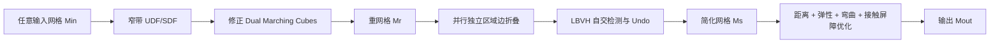

# 《PaMO: Parallel Mesh Optimization for Intersection-Free Low-Poly Modeling on the GPU》中文分析

## 1. 论文信息

- 题目：PaMO: Parallel Mesh Optimization for Intersection-Free Low-Poly Modeling on the GPU
- 作者：Seonghun Oh、Xiaodi Yuan、Xinyue Wei、Ruoxi Shi、Fanbo Xiang、Minghua Liu、Hao Su
- 会议/期刊：Pacific Graphics 2025 / Computer Graphics Forum，Vol. 44，No. 7
- arXiv：2509.05595v1
- 原始 PDF：`D:\laien\文档\remesh\2509.05595v1.pdf`
- 论文页数：19 页（含补充材料）

## 2. 核心结论

PaMO 是一套面向任意三角网格输入的全 GPU 低模生成流程。它不是单一的简化算法，而是由三个互相补偿的阶段组成：

1. **并行重网格**：将任意 triangle soup 转换为封闭、流形、实验上无自交且三角形质量较好的网格。
2. **并行无自交简化**：批量折叠彼此独立的边，通过自交检测和撤销操作保持输出无自交。
3. **安全投影**：固定简化后的连接关系，通过带接触屏障的能量优化把顶点拉回原始表面，降低重网格造成的偏移并恢复部分尖锐特征。

整体逻辑是：



三个阶段各自解决不同问题：

| 阶段 | 主要目标 | 主要代价/副作用 |
|---|---|---|
| 重网格 | 修复任意输入，获得封闭流形基础网格 | 表面膨胀、尖锐特征和小拓扑结构丢失 |
| 简化 | 快速降低面数，保持流形和无自交 | 只依据重网格结果，未直接使用原始几何 |
| 安全投影 | 减小到原网格的距离、恢复部分特征 | 固定连接关系，无法恢复已经彻底丢失的拓扑和采样密度 |

## 3. 问题定义

输入为任意网格 `Min`，输出为低模网格 `Mout`。论文希望满足：

1. `Mout` 封闭、流形且无自交；
2. 面数不超过用户给定阈值；
3. `Mout` 与 `Min` 的 Chamfer Distance 和 Hausdorff Distance 尽量小。

实现中首先将输入顶点归一化到 `[0,1]^3`。论文实验主要使用目标面数比例，例如将面数降到输入的 1%。

## 4. 第一阶段：并行重网格

### 4.1 目标

第一阶段不依赖输入的拓扑正确性，因此可以处理：

- 非流形网格；
- 开放网格；
- 自交网格；
- triangle soup；
- 存在孔洞、重复或不一致连接关系的输入。

输出 `Mr` 被后续简化器作为拓扑可靠的起点。

### 4.2 Mesh-to-Volume：层次化窄带 UDF

对每个体素中心 `x`，无符号距离定义为：

```text
u(x) = min distance(x, triangle)
```

暴力计算所有体素和所有三角形的距离不可行。PaMO 构建从低分辨率到高分辨率的体素网格层次，在每一层过滤不可能位于窄带内的“体素-三角形对”：

1. 从最粗层开始枚举候选体素-三角形对；
2. 使用体素包围球与三角形窄带的保守相交测试；
3. 不相交的候选立即删除；
4. 相交候选传播到下一层更细体素；
5. 最细层才计算精确点到三角形距离；
6. 每个体素对剩余候选距离取最小值得到 UDF。

论文设置窄带宽度为：

```text
band_width = 3 / R_DMC
```

其中 `R_DMC` 是 DualMC 分辨率。

该过程可以按输入三角形分批执行，因此峰值内存不直接随输入三角形数线性增长。

### 4.3 从 UDF 构造提取场

论文原始方法通过从 UDF 中减去固定偏移构造有正负号的标量场：

```text
s(x) = u(x) - epsilon
```

理论上，为了不遗漏 DualMC 所需的符号变化，需要：

```text
epsilon >= sqrt(3) / (2 R_DMC)
```

论文实际使用：

```text
epsilon = 0.9 / R_DMC
```

这意味着所提取的是距离原始三角形表面约 `0.9` 个体素的包络面，而不是严格意义上的原始有向 `SDF=0` 表面。因此第一阶段天然会产生表面外移。

### 4.4 GPU Dual Marching Cubes

DualMC 根据每个体素八个角点的符号查表，在体素内生成一个或多个 patch，最后围绕有效网格边连接相邻体素 patch 的代表点形成四边形。

主要流程：

1. 并行检查全部体素，根据查找表标记空体素与非空体素；
2. 通过压缩索引跳过空体素；
3. 根据查找表构建体素内部 patch；
4. 根据标量场进行线性插值，确定 patch 代表顶点；
5. 找出两个端点符号不同的有效网格边；
6. 连接有效边周围四个体素的 patch 顶点，形成四边形；
7. 将四边形划分为三角形。

实现采用“2-kernel Gather”模式：

- 第一个 kernel 计算每个元素需要的输出数量并建立索引；
- 第二个 kernel 按索引写入实际顶点和面。

DualMC 相比普通 Marching Cubes 能显著减少瘦长三角形，有利于后续并行简化。

### 4.5 DualMC 的拓扑与自交修正

原始 DualMC 在少数情况下仍可能出现非流形或自交。PaMO 做了三类修正。

#### 4.5.1 模糊查表情况

对原 DualMC 查找表中的 C16 和 C19 模糊面情况，采用 Wenger 的处理方法修正非流形连接。

#### 4.5.2 插值数值稳定性

原始线性插值参数为：

```text
t = -f(v0) / (f(v1) - f(v0))
v = v0 + t (v1 - v0)
```

当 `t` 非常接近 0 或 1 时，patch 顶点可能过于靠近体素角点，造成数值不稳定和相邻四边形相交。论文用 Sigmoid 平滑：

```text
t' = 1 / (1 + exp(-beta (t - 0.5)))
beta = 5
```

然后使用 `t'` 进行插值。

这会提高稳定性，但也会改变严格的等值面插值位置，进一步引入几何偏差。

#### 4.5.3 基于 Envelope 的四边形划分

对有效体素边周围形成的四边形，根据各顶点相对 envelope 的凹凸性决定对角线：

- 只有一条对角线包含凹顶点：沿该对角线划分；
- 两条对角线都包含凹顶点：在有效体素边上增加顶点，将四边形分成四个三角形；
- 没有凹顶点：选择能够最大化最小三角形角度的划分。

论文在 10,000 个随机 `64^3` 标量场上测试：原始 DualMC 出现 8 个自交结果，修正版没有检测到自交。应注意这是强实验结果，而不是对所有浮点输入的形式化证明。

## 5. 第二阶段：并行无自交简化

### 5.1 总体循环

简化阶段输入重网格 `Mr` 和目标面数 `Nt`：

```text
while 当前面数 > Nt:
    并行计算所有边的折叠代价
    把边代价传播到边的一环邻域三角形
    选出彼此独立的局部区域
    每个独立区域并行折叠一条边
    构建 LBVH 并检测自交
    撤销造成自交的折叠
    重复检测和撤销，直到没有自交
```

### 5.2 边折叠代价

边 `e_ab` 的总成本为：

```text
C_ab = Q_ab + w_e C_e + w_s C_s
```

其中：

- `Q_ab`：标准 Quadric Error Metric；
- `C_e = l_ab`：边长代价，优先折叠短边；
- `C_s`：折叠后关联三角形的瘦长惩罚。

单个三角形的质量为：

```text
C_ijk = 4 sqrt(3) A_ijk /
        (l_ij^2 + l_jk^2 + l_ki^2)
```

等边三角形的该值接近 1。瘦长代价累加 `1-C_ijk`。

论文默认权重：

```text
w_e = 0.001
w_s = 0.005
```

加入边长和瘦长代价非常关键：仅使用 QEM 时，平面区域中大量边的 QEM 接近相同，容易生成尺寸不均和极瘦三角形。

### 5.3 代价传播与独立区域

对每条边：

1. 找到两个端点所有一环邻接三角形的并集；
2. 将该边成本传播到这些三角形；
3. 每个三角形通过 `AtomicMin` 保留收到的最小成本；
4. 若一条边的成本等于其全部一环邻接三角形保存的成本，则该边拥有一个独立区域；
5. 拥有独立区域的边可在本轮并行折叠。

为了避免不同边具有相同浮点成本造成区域混淆，论文使用 64 位整数：

```text
高 32 位：由 float 转换的边成本
低 32 位：唯一 edge ID
```

这样既能通过整数 `AtomicMin` 选择最小项，也能稳定处理成本相同的边。

这种机制不是全局优先队列，也不是上一份论文的 Cavity/MIS；它是一种基于局部最小成本传播的无锁独立区域选择。

### 5.4 并行边折叠

每个独立区域只折叠其对应边。论文使用 Link Condition 检查折叠后的拓扑是否合法，从而保持流形性质。

循环可以根据以下任一条件终止：

- 边成本达到阈值；
- 面数达到目标。

论文实验采用目标面数。

### 5.5 GPU 自交检测

每轮批量折叠之后重新检测自交：

1. 在 GPU 上构建 triangle LBVH；
2. 每个三角形查询 BVH，得到 AABB 相交候选；
3. 对候选三角形对执行精确相交分类；
4. 输出相交三角形对及其关联的折叠操作。

论文将相交检测分为非共面和共面两类。

#### 5.5.1 非共面三角形

主要使用 Devillers 三角形相交算法。对于共享一个顶点的三角形，如果求得的相交线段极短，视为仅在共享顶点处接触；若相交线段仍然较长，则判定为自交。

共享一条边的正常三角形对直接跳过非共面自交判定。

#### 5.5.2 共面三角形

根据共享顶点数量分类：

| 共享顶点数 | 判断方法 |
|---:|---|
| 0 | 普通二维共面三角形相交测试 |
| 1 | 共享点处的角区间重叠测试 |
| 2 | 共享边两侧测试 |
| 3 | 重合三角形，判为相交 |

共享一个顶点时，算法比较四组边向量的叉积符号，并进一步计算角度和，区分正常扇形邻接与角区间重叠。

共享一条边时，将共享边扩展为直线：

- 两个剩余顶点位于共享边两侧：正常邻接；
- 位于同一侧：发生共面重叠。

### 5.6 混合精度

全 float 速度快但存在漏检，全 double 成本过高。PaMO 只在两个关键步骤使用双精度：

- 共面判定；
- Devillers 算法中的三角形相交线计算。

论文测试集中：

- 混合精度版本 Recall 为 1.0、FNR 为 0；
- 但 FPR 约为 1.14%；
- 即宁可保守地多报少量相交，也避免漏掉真实自交。

“无自交保证”依赖该检测器不产生 false negative。论文提供了较强的实验验证，但在有限精度计算中仍应理解为实现级、测试支持的保证，而不是精确谓词意义下的绝对数学证明。

### 5.7 Undo 撤销策略

自交检测返回相交三角形和导致这些三角形变化的折叠操作。系统恢复相关折叠前的边和局部网格。

一次撤销可能与其他仍然保留的折叠结果发生新交叉，因此必须：

```text
检测自交
→ 撤销相关折叠
→ 再次检测
→ 继续撤销
→ 直到无自交
```

论文全 Thingi10K 约 220 万轮批量折叠中：

- 72.15% 不需要 Undo；
- 26.62% 需要 1 轮；
- 1.22% 需要 2 轮；
- 约 0.0007% 需要 3 轮；
- 没有出现超过 3 轮的样例。

### 5.8 Invalid Edge 防止反复失败

若一条低成本边本轮折叠后因自交被撤销，下轮仍可能再次被选中。论文将其标记为 invalid：

- 正常情况下 invalid 标记保留一轮；
- 如果本轮所有折叠都被撤销，继续累积 invalid 边；
- 一旦有折叠成功，重新开始；
- 连续失败达到 tolerance 后停止；
- 默认 `tolerance = 4`。

这防止简化器在极端目标面数下陷入“折叠-撤销-再折叠”的循环。

## 6. 第三阶段：安全投影

### 6.1 目标与约束

安全投影输入简化网格 `Ms` 和原始输入 `Min`，只修改顶点位置，不改变面和边连接关系。

目标包括：

1. 减小 `Ms` 到 `Min` 的距离；
2. 防止投影重新生成过瘦、过大或过小的三角形；
3. 防止局部弯曲角异常；
4. 保证优化轨迹中不发生自交。

### 6.2 双向距离能量

论文用两个方向近似 Chamfer Distance。

#### 6.2.1 输出到输入 `E_S2M`

对输出网格每个顶点 `x_i` 找到其在原始网格上的最近点，并用初始简化网格上的顶点 Voronoi 面积 `s_i^0` 加权：

```text
E_S2M = sum_i s_i^0 ||x_i - nearest_Min(x_i)||^2
```

它把输出顶点拉向原始表面。

#### 6.2.2 输入到输出 `E_M2S`

在原始网格表面均匀采样 `m=16384` 个点，对每个样本寻找当前输出网格上的最近点：

```text
E_M2S = A(Min)/m * sum_j distance(y_j, S)^2
```

它防止输出网格忽略原始网格的某些部分。单向 `S→M` 只能保证输出上的点靠近输入，无法保证输入的所有区域都被输出覆盖。

### 6.3 弹性能量

论文把简化网格视为超弹性薄壳，使用 St. Venant-Kirchhoff 膜能量，惩罚每个三角形相对 `Ms` 的拉伸和剪切：

```text
E_elas = sum_triangles
         1/(4 A0) ||F^T F - I||_F
```

它具有旋转不变性，主要保持三角形形状，降低安全投影重新产生瘦长三角形的风险。

### 6.4 弯曲能量

对每条内边，惩罚当前二面角与初始简化网格二面角的差：

```text
E_bend = sum_edges
         1/(2 l0) (theta - theta0)^2
```

它限制相邻三角形之间发生过大的折弯变化。

### 6.5 总几何能量

```text
E = k_dis E_dis + k_elas E_elas + k_bend E_bend
E_dis = E_S2M + E_M2S
```

论文实验权重：

```text
k_dis  = 1e3
k_elas = 1e-1
k_bend = 1e-2
```

距离项占主导，弹性和弯曲项作为质量正则。

### 6.6 接触屏障

对输出网格中的所有潜在接触对：

- 点-三角形；
- 边-边；

当距离 `d` 小于激活距离 `d_hat` 时，加入 IPC 风格屏障：

```text
b(d) = -(d-d_hat)^2 log(d/d_hat),  0 < d < d_hat
b(d) = 0,                          d >= d_hat
```

增广能量为：

```text
B(X) = E(X) + k_bar sum_c b(d_c(X))
```

论文设置：

```text
k_bar = 1e2
d_hat = 1e-3
```

当距离趋近零时屏障趋近无穷，阻止接触对穿越。

### 6.7 Newton 型求解器

每轮优化：

1. 计算增广能量的梯度和 Hessian；
2. 通过特征值修正把 Hessian 投影成 SPD 矩阵；
3. 使用共轭梯度求解 Newton 方向 `p`；
4. 使用 ACCD 计算沿 `p` 的无碰撞最大步长；
5. 从 `min(1, alpha_safe)` 开始回溯线搜索；
6. 只有能量下降才接受；
7. 重复到固定迭代次数。

论文默认：

- 安全投影执行 `T=50` 轮；
- 最近点目标每 10 轮更新一次；
- 实验中通常 30-50 轮收敛。

由于每一段线性移动轨迹都受到 ACCD 限制，优化过程不会通过离散时间步“跨过”一次碰撞。

## 7. 关键参数汇总

| 参数 | 论文默认值 | 作用 |
|---|---:|---|
| `R_DMC` | 通常 256 | 距离场与 DualMC 分辨率 |
| 小目标面数下的分辨率 | `<1000` 用 128；`<50` 用 64 | 避免低面数任务产生过多初始面 |
| 窄带宽度 | `3/R_DMC` | UDF 需要计算的表面邻域 |
| 包络偏移 `epsilon` | `0.9/R_DMC` | 将 UDF 转换为可提取的正负场 |
| Sigmoid `beta` | 5 | 抑制 DualMC 极端插值 |
| `w_e` | 0.001 | 边长成本权重 |
| `w_s` | 0.005 | 瘦长三角形成本权重 |
| simplification tolerance | 4 | 连续无有效折叠时的停止容限 |
| 原网格表面样本数 `m` | 16384 | `E_M2S` 近似 |
| `k_dis` | `1e3` | 距离能量权重 |
| `k_elas` | `1e-1` | 弹性能量权重 |
| `k_bend` | `1e-2` | 弯曲能量权重 |
| `k_bar` | `1e2` | 接触屏障权重 |
| `d_hat` | `1e-3` | 接触屏障激活距离 |
| Safe Projection 轮数 | 50 | Newton 型优化轮数 |
| 最近点更新周期 | 10 轮 | 降低最近邻查询成本 |

所有距离相关参数均建立在输入归一化到 `[0,1]^3` 的前提下。

## 8. 论文实验结果

### 8.1 1% 面数实验

在 100 个平均约 72 万面的 Thingi10K 子集上：

| 方法 | 时间 | HD (`1e-2`) | CD (`1e-4`) | 最小角 | 流形率 | 无自交率 |
|---|---:|---:|---:|---:|---:|---:|
| PaMO 无 Stage 3 | 0.86 s | 3.439 | 0.8468 | 3.317° | 100% | 100% |
| 完整 PaMO | 1.95 s | 2.294 | 0.1846 | 2.994° | 100% | 100% |

安全投影显著改善距离，但最小三角形角略有下降，说明“贴近原始几何”和“保持均匀高质量三角形”之间存在权衡。

### 8.2 全 Thingi10K

排除 5 个损坏文件后：

- 1% 面数比例下，超过 98% 的网格在 2 秒内完成；
- 不包含安全投影时，超过 97% 在 1 秒内完成；
- 完整方法平均约 1.23 秒；
- 报告的输出无自交率为 100%。

这些时间在 RTX 4090 上测得，不包括跨硬件和不同实现环境的性能差异。

### 8.3 重网格性能

在 124 个非封闭且有自交的输入上，论文的 GPU 重网格平均约 2.97 ms，明显快于 OpenVDB 和其他 CPU 方法。

### 8.4 边成本消融

在 100 个网格上，最小角小于 10° 的坏三角形比例：

| 成本配置 | 坏三角形比例 |
|---|---:|
| 不使用边长和 skinny 成本 | 13.16% |
| 不使用边长成本 | 13.32% |
| 不使用 skinny 成本 | 3.72% |
| 完整成本 | 2.81% |

边长成本主要改善平面区域的均匀度，skinny 成本直接抑制瘦长面。

### 8.5 极端简化

当面数比例低于 1% 时，几何误差明显增大。论文示例中：

- 1%：CD 约 `0.0001`，HD 约 `0.0045`；
- 0.5%：CD 约 `0.0064`，HD 约 `0.0498`；
- 0.25%：CD 约 `0.0161`，HD 约 `0.0652`。

此时越来越多低成本边会造成自交并被列入 invalid 集合，简化自由度快速减少。

## 9. 特征保持能力分析

PaMO 的特征恢复主要来自 Stage 3 的双向距离能量，而不是显式的特征边约束。

它能较好恢复：

- 重网格后仍有足够顶点表达的大尺度折角；
- 简化连接关系仍与原形状兼容的边缘；
- 安全投影最近点能够稳定匹配的平面与曲面结构。

它难以恢复：

- 小于体素尺寸的孔洞、缝隙和薄结构；
- Stage 1 已完全抹掉的局部拓扑；
- Stage 2 已删除且剩余连接关系无法表达的尖角；
- 顶点密度不足以拟合的窄槽和高曲率特征；
- 需要沿显式特征曲线保持采样 lineage 的 CAD 边。

弹性和弯曲能量会尽量保持 `Ms` 的三角形与二面角，而不是原始网格 `Min` 的特征角度。它们有助于避免投影畸变，但也可能阻碍顶点完全回到尖锐原特征。

因此，PaMO 的“恢复 sharp features”应理解为几何距离优化带来的部分恢复，不等价于硬特征保留。

## 10. 论文明确给出的局限

1. **小网格没有明显速度优势**：重网格会增加面数，而直接简化又容易产生自交。
2. **体素分辨率会改变拓扑**：小于 DualMC 体素的孔洞和缝隙可能消失。
3. **布料或薄壳可能生成双层表面**：UDF 包络会在原薄面两侧提取两个层。
4. **Stage 2 与原始输入解耦**：简化只看 `Mr`，不直接优化到 `Min` 的几何误差。
5. **Stage 3 连接关系固定**：无法通过重新分裂、折叠或翻边来恢复丢失特征。
6. **极端低面数下误差增大**：可合法折叠的候选迅速耗尽。

论文将“联合优化连接关系和顶点位置”列为未来方向。

## 11. 对算法保证的审慎理解

### 11.1 封闭与流形

对规则体素网格上的修正 DualMC，封闭和流形性质具有较强的构造基础，但仍依赖：

- 标量场符号和查找表处理正确；
- 模糊情况修正完整；
- 浮点插值和四边形划分不会产生退化。

### 11.2 无自交

无自交来自两层保护：

1. Stage 1 的修正 DualMC；
2. Stage 2 的“检测-Undo”循环和 Stage 3 的 IPC/ACCD。

其中 Stage 2 的保证依赖相交检测器无漏检。论文测试 FNR 为 0，并在 Thingi10K 输出上达到 100% 无自交，但没有使用任意精度谓词给出覆盖所有退化输入的形式化证明。

### 11.3 面数目标

当剩余候选全部因拓扑或自交约束失效时，算法可能因为 tolerance 停止，论文实现中会提示缺少可折叠边。因此“达到目标面数”受到合法折叠存在性的限制。

### 11.4 几何相似度

Chamfer Distance 是平均型指标，无法单独保证最大局部偏差；Hausdorff Distance 更适合约束最坏局部误差，但论文将它作为评估指标，而不是 Stage 2 的硬约束。

## 12. 与当前项目的对应关系

当前仓库正是 PaMO 的代码基础，主结构与论文一致：

- `simp_cuda/pamo/__init__.py`：三阶段 Python 调度；
- `simp_cuda/src/cusimp*.cu`：并行边成本、独立区域折叠和 Undo；
- `simp_cuda/src/bvh/`：LBVH 与三角形相交检测；
- `simp_cuda/safe_project/`：安全投影能量和求解器；
- `torchcumesh2sdf` 与 `DMC`：Stage 1 的体素距离和 DualMC。

但当前仓库已经包含论文 v1 之后的扩展，因此不能把所有现有功能都视为论文原始算法：

- `sdf_mode=auto/exact/repair`：论文原始 Stage 1 使用 `UDF-0.9/R` 包络；当前代码对有效封闭输入可使用原始有向零面。
- `--feature-remesh`：在 SDF 重网格后执行安全投影，不做简化。
- `--sdf-optimize`：固定连接关系的 SDF 切向质量优化。
- `--original-constrained-remesh`：保留原始连接骨架与硬特征 lineage。
- 特征边匹配和只沿特征边细分：属于当前仓库扩展，不在论文 v1 中。

因此：

> 当前项目的默认 `run()` 三阶段路径与 PaMO 论文主体高度对应；新增的 SDF 模式、特征重网格和原始连接约束模式不是论文 v1 的严格复现，而是后续扩展。

## 13. 如果用于高保真特征重网格

论文原始 PaMO 可以作为可靠的基础，但若目标是严格保留 CAD 尖角、孔洞和特征线，建议增加：

1. 在原始网格上提取并保存 feature graph；
2. 特征角点固定或投影回原角点；
3. 特征边顶点只能沿原特征曲线移动；
4. 禁止跨特征边折叠和翻边；
5. 为高曲率/尖锐区域使用自适应体素分辨率；
6. 将到原网格的最大距离作为边折叠硬约束；
7. 联合执行拓扑优化与安全投影，而不是完全分成 Stage 2 和 Stage 3；
8. 使用原始网格和 SDF 的双重合法性检查。

一个更强的改进流程可以是：

```text
输入清理和特征图提取
→ 对有效封闭输入使用精确 SDF=0
→ 对缺陷输入使用 repair envelope
→ 修正 DualMC
→ 将原始 feature graph 匹配到重网格
→ 带 feature/max-distance 约束的并行边折叠
→ 每轮折叠后执行 LBVH 自交检测和 Undo
→ 连接关系与顶点位置交替优化
→ IPC/ACCD 安全投影
→ HD、特征召回率、流形和自交最终验收
```

## 14. 总结

PaMO 的核心价值在于把三个困难问题组合成了一条高效 GPU 管线：

- 通过体素场和修正 DualMC 解决任意输入的拓扑修复；
- 通过局部成本传播选择无冲突独立区域；
- 通过 GPU LBVH、鲁棒三角形测试和 Undo 保证简化阶段不保留新自交；
- 通过双向距离、薄壳正则、IPC 屏障、ACCD 和 Newton 型求解器安全恢复几何。

它在大规模、缺陷较多、需要快速生成低模封闭网格的场景中具有很高的实用性。其主要短板是体素化造成的小特征丢失，以及“先优化连接、再优化位置”的阶段解耦。对一般扫描模型和游戏资产，这种取舍非常有效；对需要严格保留拓扑小孔、薄壳和 CAD 特征线的任务，还需要显式特征约束和联合拓扑-几何优化。
